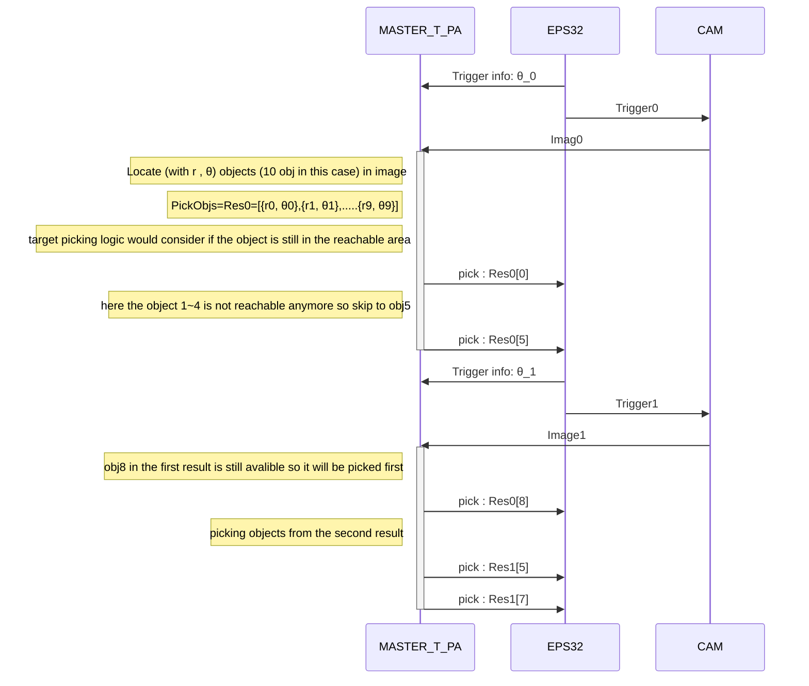

```mermaid
%% Example of sequence diagram
  sequenceDiagram

    participant MASTER_T_PA

    EPS32->>MASTER_T_PA:Trigger info: θ_0
    EPS32->>CAM:Trigger0
    CAM->>MASTER_T_PA:Imag0

    activate MASTER_T_PA

    Note left of MASTER_T_PA: Locate (with r , θ) objects (10 obj in this case) in image
    Note left of MASTER_T_PA: PickObjs=Res0=[{r0, θ0},{r1, θ1},.....{r9, θ9}]

    Note left of MASTER_T_PA: target picking logic would consider if the object is still in the reachable area
    MASTER_T_PA->>EPS32:pick : Res0[0]
    Note left of MASTER_T_PA: here the object 1~4 is not reachable anymore so skip to obj5
    MASTER_T_PA->>EPS32:pick : Res0[5]
    deactivate MASTER_T_PA


    EPS32->>MASTER_T_PA:Trigger info: θ_1
    EPS32->>CAM:Trigger1
    CAM->>MASTER_T_PA:Image1


    activate MASTER_T_PA


    Note left of MASTER_T_PA: obj8 in the first result is still avalible so it will be picked first
    MASTER_T_PA->>EPS32:pick : Res0[8]
    Note left of MASTER_T_PA: picking objects from the second result
    MASTER_T_PA->>EPS32:pick : Res1[5]
    MASTER_T_PA->>EPS32:pick : Res1[7]
    deactivate MASTER_T_PA


```